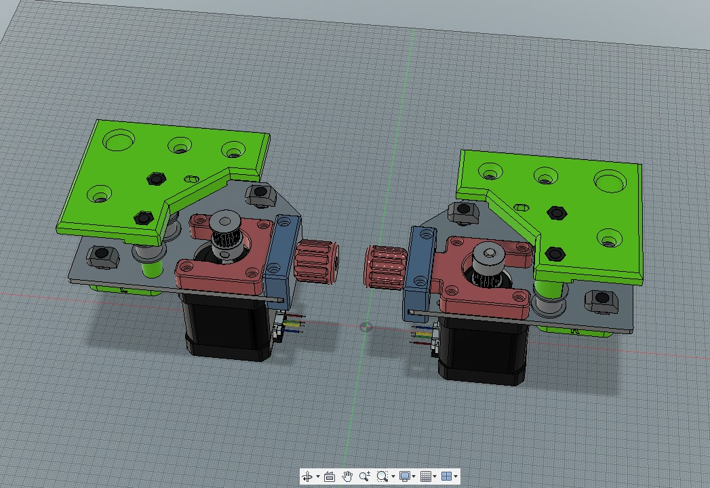

# V-Core-3-XY-Motor-Tension-System
Belt tension system for XY motors for Ratrig V-Core 3 printers

This is a mod for Ratrig V-Core 3 printers that uses the Left and Right XY stepper motor mounts to tension the belts.  This system replaces the top rear motor-cage parts, and uses new laster-cut mounting plates in place of the original parts.

The idea is to remove the weight of the tensioning hardware off of the printer carriage.  I have made a new back for the standard EVA 3 carriage.  Personally, I'm using a different carriage based on the VZ-Bot design, which I will post in it's own repository.

1.  The DXF file for the new mounting plates are included in the repository.  You will need to have these made by a shop that does metal laser cutting.  
2.  the tension forks and knobs require the use of additional M3 hardware:

     -  (8) M3x12mm socket head screws for the tension forks
     -  (4) M3x20mm socket head screws for the end blocks that mount to the plate edge
     -  (2) M3x35mm socket head screws for the tension knobs
     -  (8) M3 nuts.
 
 Assembly is straight-forward.  Please consult the video for a quick demonstration.
